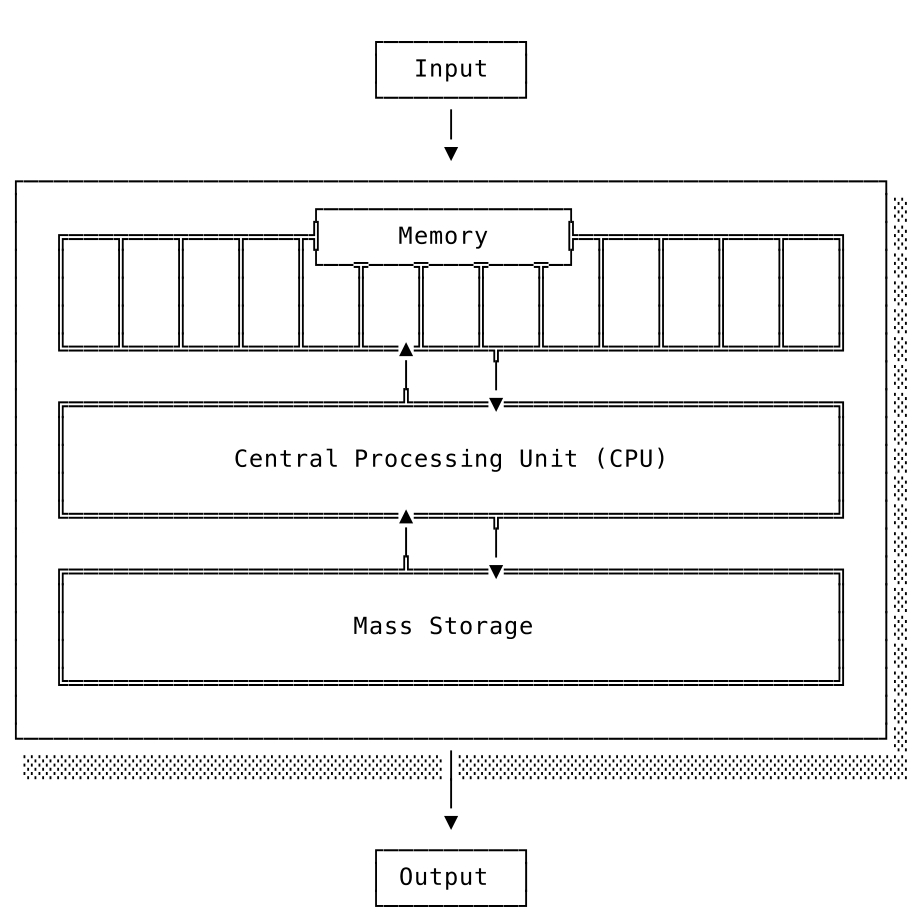

## 虚拟机和真实机

在编程领域，"虚拟机"（Virtual Machine, VM）这个词通常会让人们想到像VMware或VirtualBox这样的软件。这些程序模拟了一台完整的计算机，包括磁盘驱动器、硬盘、显卡等硬件组件。它们允许你在这种模拟的环境中运行不同的操作系统。没错，这些都是虚拟机的一种形式。但是，我们接下来要讨论的是另一种类型的虚拟机。

我们将要讨论并随后构建的虚拟机是用来实现编程语言的。有时候它们只包含几个函数，有时候它们由几个模块组成，有时则是一系列类和对象的集合。很难具体定义它们的形式。但重要的是：它们并不模拟现有的机器；它们本身就是一台机器。

之所以被称为“虚拟”，是因为它们仅存在于软件中，并非物理硬件，因此是纯粹的抽象结构。“机器”一词描述了它们的行为。这些软件构造就像一台机器一样工作。而且不是任何一种机器，而是模仿其硬件对应物——计算机的行为。

这意味着，为了理解和构建一个虚拟机，我们需要学习真实机器的工作原理。

### 真实机

“那么，计算机是如何工作的？”

这个问题听起来可能有些令人生畏，但实际上可以在五分钟内用一张纸来解释。虽然我不知道你阅读的速度有多快，而且我也不能展示我在纸上画的图，但我还是试着来解释一下。

在你的生活中几乎每一台计算机都是按照冯·诺依曼架构（Von Neumann architecture）构建的，这种架构描述了一种使用惊人的少量部件来构建一台功能齐全的计算机的方法。

在冯·诺依曼模型中，计算机有两个核心部分：一个处理单元，它包含算术逻辑单元（ALU）和多个处理器寄存器；以及一个控制单元，它包括指令寄存器和程序计数器。这两个部分合在一起被称为中央处理单元，通常简称为CPU。除此之外，计算机还包含内存（RAM）、存储设备（比如硬盘驱动器）和输入/输出设备（如键盘和显示器）。

CPU、内存、存储设备和I/O。这里有一个这样的计算机的大致草图：

当计算机启动后，CPU会执行以下步骤：

> **1. 从内存中获取指令。** 程序计数器告诉CPU在内存中的哪个位置可以找到下一条指令。
> **2. 解码指令。** 识别出应该执行的操作。
> **3. 执行指令。** 这可能意味着修改寄存器的内容、将数据从寄存器转移到内存、在内存中移动数据、生成输出或读取输入等。
>
> **… 然后回到第一步继续**

这三步被称为 `取指-译码-执行` 周期，或指令周期。是的，这就是从诸如“计算机的时钟速度以每秒周期数表示，例如500 MHz”或“我们在这里浪费了CPU周期”这样的句子中所熟知的周期。

这是一个简短且易于理解的关于计算机工作原理的描述。但是我们可以让它对我们来说更加简单。在这本书中，我们不关心大容量存储组件，而仅略微关注输入/输出机制。我们感兴趣的是CPU和内存之间的相互作用。这意味着我们可以将重点放在这上面，并安全地忽略硬盘驱动器和显示器。

我们的调查从这个问题开始：CPU如何寻址内存的不同部分？换句话说：CPU如何知道在内存中存储和检索位于何处的数据？

我们通过CPU获取指令的方式得到了第一个提示。程序计数器，作为CPU的一部分，跟踪下一个指令应该从哪里获取。这里的“计数器”确实应该按字面意思理解：计算机只是使用数字来寻址内存的不同部分。是的，就是数字。

此时，我忍不住想写“只要把内存想象成一个巨大的数组”，但是我害怕有人用一本厚重的、皮革封面的书《关于内存绝对无疑不像数组的事情，你这个傻瓜》打我的头，所以我不会这么写。但没错，就像我们作为程序员使用数字作为索引来访问数组中的单个元素一样，CPU在访问内存中的数据时也使用数字作为地址。

与“数组元素”不同，计算机内存被分割成“字”。那么，“字”是什么？它是内存中最小可寻址区域。它是访问内存的基本单位。字的大小会有所不同，取决于CPU类型等因素。然而，在你我使用的计算机中，32位和64位的字长是标准。

假设我们有一台虚构的计算机，其字长为8位并且有13字节的内存。内存中的一个字可以保存一个ASCII字符，如果我们把字符串Hello, World! 存入内存，它看起来像这样：

字母“H”的内存地址是0，“e”的是1，第一个“l”的是2，“W”的是7，以此类推。我们可以通过使用从0到12的内存地址来访问字符串Hello, World! 中的每一个字母。“嘿CPU，获取内存地址4处的字”将导致CPU获取字母“o”。很直接，对吧？我知道你现在在想什么，是的，如果我们取这样的一个数字——一个内存地址——并将其保存到内存中的另一个地方，我们就创建了一个指针。

这就是内存中数据寻址的基本概念，以及CPU如何知道在哪里获取和存储数据。然而，正如我之前提到的，现实世界总是复杂的。不同计算机之间的字长会有所不同。有时它是8位，有时是16、24、32或64位。有时CPU使用的字长与地址长度是独立的。而且如果这还不够处理：有些计算机完全采取不同的方式，使用字节寻址而不是刚才描述的字寻址。

如果你正在使用字寻址，并且想要寻址单个字节（这并不罕见），你不仅要处理不同的字长，还要处理偏移量。而这样做通常是昂贵的，并需要进行优化。

除此之外：我们能够简单地告诉CPU在内存中存储和检索数据的位置这个想法更像是童话故事。在概念层面上这是正确的，也有助于学习，但今天的内存访问已经被抽象化，并隐藏在层层的安全性和性能优化之后。内存不再是无法无天的地方——我们不能随便访问任何想要的内存位置。安全规则和一种称为虚拟内存的机制尽最大努力阻止这种情况发生。

不过，在这里我要停下来，以免我们偏离主题，最终讨论起虚拟内存的工作原理。这不是我们的目的。你可以从这次简短探讨中得到的是，今天的内存访问不仅仅是向CPU传递一个数字那么简单。不仅有安全规则存在，在过去的几十年里，围绕内存的使用也出现了一套不那么严格的惯例。

冯·诺伊曼架构的一个新颖方面在于，计算机的内存不仅包含数据，还包含了程序，即构成程序的CPU指令。对于程序员来说，混合数据和代码的想法听起来就像是灾难的配方。对于几代之前的程序员来说，可能也是如此。因为他们所做的是建立关于内存使用的惯例，以防止这种情况的发生。

虽然程序与其他数据存储在同一内存中，但它们通常不会存储在相同的位置。特定区域的内存被用来存储特定的东西。这不仅是出于惯例，也是由操作系统、CPU和整个计算机架构规定的。

所谓的“纯数据”，比如“文本文件的内容”或“HTTP请求的响应”，会放在内存的一个区域。组成程序的指令则存储并访问于另一个区域，这样CPU可以轻松地获取它们。还有另一个区域存放程序使用的静态数据，还有一个未初始化的空闲区域，但已被预留出来，以便程序运行时可以使用。属于操作系统内核的指令在内存中有自己的特殊区域。

顺便说一下：虽然程序和“纯数据”可能位于不同的内存位置，但重要的是它们都存储在同一内存中。“数据和程序都存储在内存中”这种说法可能会让人觉得它们是截然不同的，但实际上，程序——由指令组成——也是一种数据。只有当CPU从内存中获取指令，解码它们，并发现它们确实是合适的指令后，才会执行这些指令。如果CPU尝试解码非有效指令的数据，那么后果将取决于CPU的设计。它可能会触发一个事件，给程序一个恢复的机会，或者只是停止执行。

对我们来说，最有趣的是一个特别的内存区域。那就是存放堆栈的内存区域。是的，堆栈。鼓声响起，号角吹响，聚光灯下，深沉的声音宣布：堆栈。你可能听说过它。“堆栈溢出”可能是它最著名的作品，其次是不太流行但同样受尊敬的“堆栈跟踪”。

那么，它是什么呢？它是一个内存区域，其中的数据以后进先出（LIFO）的方式管理。其中的数据增长和缩减，你可以将元素压入堆栈，稍后再弹出。就像堆栈数据结构一样。但是，与这种通用数据结构不同，堆栈专注于一个目的：它用于实现 **[调用栈](https://en.wikipedia.org/wiki/Call_stack)** 。

好的，让我们在这里停下来；这确实令人困惑。“堆栈”、“那个堆栈”、“堆栈数据结构”、“调用堆栈”——这些术语其实并不自明。而且由于这些名称经常被互换使用，并且混在一起讨论，所以情况变得更加复杂。但幸运的是，如果我们对这些名称的使用更加谨慎，并且关注它们背后的“为什么”，事情就会变得清晰得多。因此，让我们再次尝试，并一步一步地进行解释。

我们有一个内存区域，在这个区域内CPU以后进先出（LIFO）的方式访问和存储数据。这样做是为了实现一种特殊版本的堆栈，称为调用堆栈。

为什么需要调用栈？因为CPU（或者可能是希望CPU按预期工作的程序员）需要跟踪某些信息以执行程序。调用栈在这方面提供了帮助。需要跟踪哪些信息呢？首先最重要的是：当前正在执行哪个函数以及在当前函数完全执行后应该执行哪条指令。这条关于接下来要获取哪条指令的信息被称为返回地址。它是CPU在执行完当前函数后返回的位置。如果没有这个信息，CPU只会增加程序计数器，并执行内存中下一个更高地址的指令。而这可能与应该发生的情况完全相反。指令并不是按照执行顺序依次存储在内存中的。想象一下，如果你的Go代码中的所有return语句都消失了——这就是为什么CPU需要跟踪返回地址的原因。调用栈还有助于保存与函数执行相关的数据：函数调用的参数和仅在该函数内使用的局部变量。

返回地址、参数和局部变量——理论上我们可以将这些信息保存在任何其他可访问的内存区域，以我们喜欢的方式。但事实证明，使用栈来保存这些信息是完美的，因为函数调用通常是嵌套的。当进入一个函数时，数据被压入栈中。而在执行当前函数时，不需要访问外部调用函数的局部数据。只需要访问栈顶部分即可。一旦当前函数返回，局部数据就会从栈中弹出——不再需要它们了。这就留下了外部函数的局部数据位于栈顶。很整洁，对吧？

所以这就是我们需要调用栈以及它为何实现为栈的原因。现在唯一的问题是：为什么会有这个臭名昭著的名字？为什么叫“栈”而不是随便说“嗯，我猜，是的，它是个栈，对吧”？因为使用这块内存区域来实现调用栈是一种如此根深蒂固且广泛遵循的惯例，以至于现在已经固化到了硬件层面。某些CPU支持专门用于栈上推入和弹出数据的指令。运行在这些CPU上的每个程序都以这种方式使用这块内存区域来实现这种机制。没有办法绕过这一点。这就是为什么它被称为栈，而不仅仅是任意的栈。

但是请记住，调用栈的概念只是一个概念。它并不绑定到特定的实现或特定的内存区域。可以将调用栈实现在内存中的任何其他地方——只不过没有硬件或操作系统的支持罢了。事实上，这正是我们将要做的。我们将实现自己的调用栈，一个虚拟的调用栈。但在我们这样做并从物理转向虚拟之前，还需要了解另一个概念以做好充分准备。现在你已经知道栈是如何工作的了，你可以想象CPU在执行程序时需要多么频繁地访问这一块内存区域。非常频繁。这意味着CPU访问内存的速度限制了它执行程序的速度。虽然内存访问速度很快（CPU可以在你眨眼间访问主存约一百万次），但它不是即时的，仍然有成本。

这就是为什么计算机还有一个地方可以存储数据：处理器寄存器。寄存器是CPU的一部分，访问它们比访问主存快得多。自然而然，有人可能会问，为什么不把所有东西都存储在寄存器里？因为寄存器数量有限，而且不能像主存那样容纳大量数据，通常每个寄存器只能保存一个字的数据。例如，x86-64架构的CPU有16个通用寄存器，每个寄存器持有64位数据。

寄存器用于存储小但经常访问的数据。指向栈顶的内存地址，例如，通常存储在寄存器中——这里的“通常”是一个轻描淡写的说法。这种特定的寄存器用途是如此普遍，以至于大多数CPU都有一个专门用来存储这个指针的寄存器，即所谓的栈指针。某些CPU指令的操作数及其结果也可能存储在寄存器中。如果CPU需要加两个数字，这两个数字都会存储在寄存器中，加法的结果也会存储在一个寄存器中。不仅如此，寄存器还有很多其他用途。这里再举一例：如果程序中有一大块数据经常被访问，那么将它的地址存储到寄存器中是有意义的，这样CPU就能快速访问它。对我们来说最重要的就是栈指针。我们很快就会再次遇到它。

现在... 深呼吸，放松一下，因为：就这样！既然我们提到了寄存器并且知道了什么是栈指针，我们就已经涵盖了有关实际机器工作原理的所有需要知道的内容。现在是时候从物理转向抽象，走向虚拟了。

|[⬅ 编译器](./6编译器.md)|[什么是虚拟机 ➡](./8什么是虚拟机.md)|
| --- | --- |
